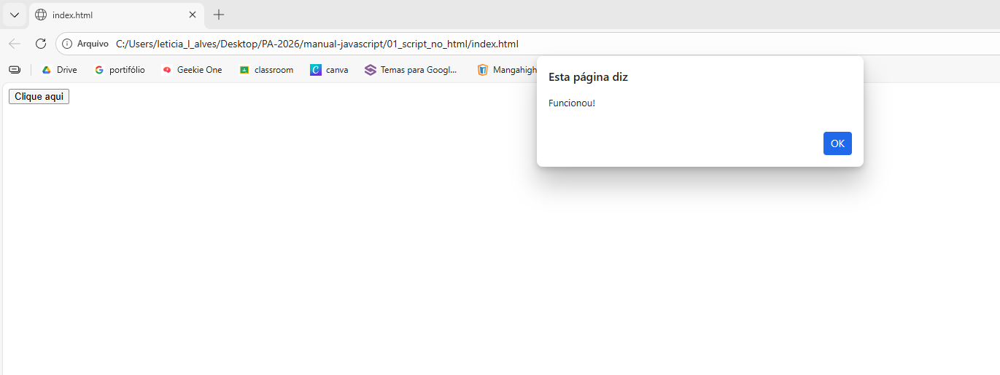
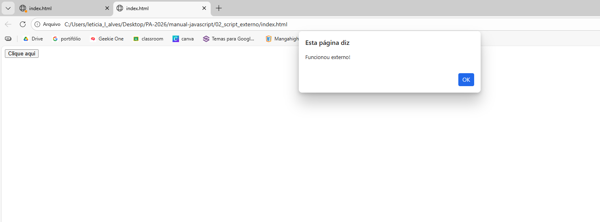
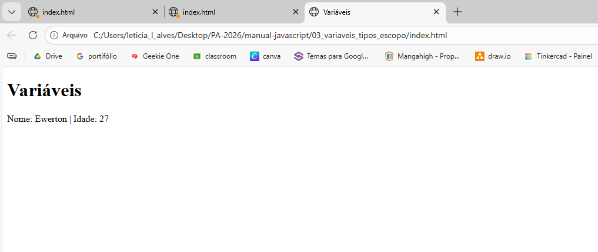
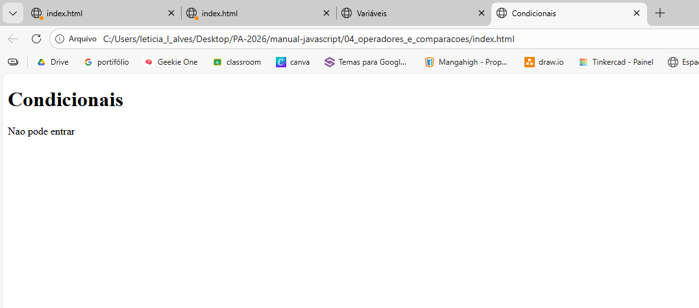
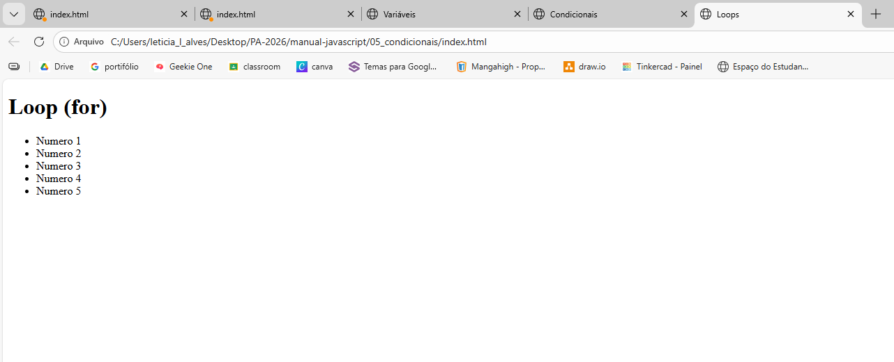
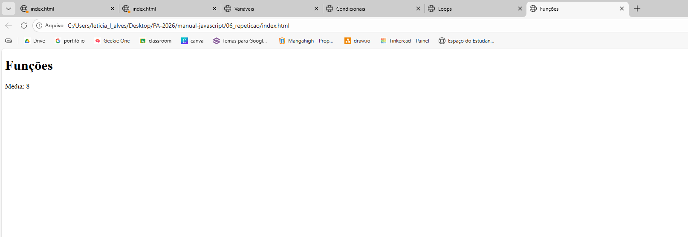
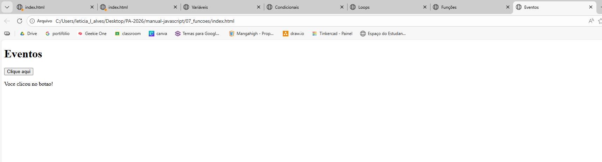
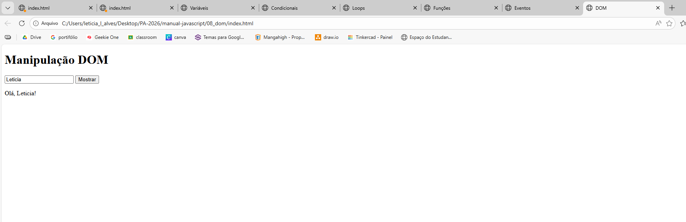

# Manual Básico de JavaScript para Web

## ➤ Introdução

### O que é JavaScript?

JavaScript é uma linguagem de programação utilizada para tornar páginas web interativas. Com ela, dá pra clicar em coisas, preencher formulários e ver mudanças na hora, sem precisar recarregar a página. Deixa tudo mais dinâmico e menos parado.

### Para que serve?

⭑ Criar interatividade em páginas web

⭑ Responder ações do usuário

⭑ Manipular elementos HTML

⭑ Validar formulários

⭑ Alterar estilos dinamicamente


### Relação com HTML e CSS

HTML = estrutura da página

CSS = aparência e estilo

JavaScript = comportamento e interatividade


## ➤ Formas de uso no HTML

### JavaScript dentro do HTML

꒰ ✉︎ ꒱ Pasta: ``` 01_script_no_html ```

```html
<!DOCTYPE html>
<html>
<head>

  <title>Exemplo</title>

</head>
<body>

<button onclick="mostrarMensagem()">Clique aqui</button>

<script>
function mostrarMensagem() {
  alert("Hello World!");
}
</script>

</body>
</html>
```

### JavaScript em arquivo separado

꒰ ✉︎ ꒱ Pasta: ``` 02_script_externo ```

```html
<script src="script.js"></script>
```

```javascript
function mostrarMensagem() {
  alert("Hello World!");
}
```

## ➤ Variáveis, tipos e escopo

### O que é uma variável?

É um espaço na memória usado para armazenar um valor que pode ser utilizado no programa.

### Declaração de variáveis

```javascript
var nome = "Ewerton";
let idade = 27;
const curso = "DS";
```

### Diferença entre var, let e const

var = escopo global ou de função

let = escopo de bloco

const = valor constante (não pode ser alterado)


### Exemplos 

**Exemplo com var**

```javascript
var x = 10;
console.log(x);
```

**Exemplo com let**

```javascript
let y = 20;
console.log(y);
```

**Exemplo com const**

```javascript
const z = 30;
console.log(z);
```

## ➤ Escopo

### Escopo global

```javascript
var numeroGlobal = 1;

function teste() {
   console.log(numeroGlobal);
}
```

### Escopo de função

```javascript
function exemplo() {
  let x = 10;
  console.log(x);
 }

console.log(x); // erro: fora da função
```

A variável "x" foi criada dentro da função e não pode ser usada fora dela.

### Escopo de bloco

```javascript
if (true) {
 let b = 2;
 console.log(b);
}

console.log(b); // erro: fora do bloco
```

A variável "b" só existe dentro do bloco.

### Var fora do bloco

```javascript
var numero = 10;
if (true) {
 var numero = 20;
}

console.log(numero); 
```

var não respeita escopo de bloco, por isso o valor foi alterado.

## ➤ Operadores, comparações e lógica

### Operadores aritméticos

⭑ Adição (+): Soma dois valores. Também usado para concatenar strings.

⭑ Subtração (-): Subtrai o segundo operando do primeiro.

⭑ Multiplicação (*): Multiplica dois valores.

⭑ Divisão (/): Divide o primeiro operando pelo segundo.

### Comparações

```javascript
console.log(5 == "5");   // true
console.log(5 === "5");  // false
console.log(5 != "5");   // false
console.log(5 !== "5");  // true
```

⤷ **==** compara só o valor, enquanto **===** compara o valor e o tipo também.

⤷ O **===** é mais seguro porque evita confusão, já que não considera iguais coisas que têm tipos diferentes, tipo número e string.

### Operadores lógicos

⭑ E = &&

⭑ OU = ||

⭑ NÃO = !

## ➤ Estruturas condicionais

if

```javascript
let idade = 17;

if (idade >= 18) {
  console.log("Pode entrar na festa");
} else {
  console.log("Não pode entrar");
}
```

if...else

```javascript
if (idade >= 18) {
  console.log("Maior");
} else {
  console.log("Menor");
}
```
switch

```javascript
let dia = "segunda";

switch (dia) {
  case "segunda":
    console.log("Dia de estudar");
    break;
  case "sexta":
    console.log("Sextou");
    break;
  default:
    console.log("Dia normal");
}
```

### ➤ Estruturas de repetição

for

```javascript
for (let i = 0; i < 5; i++) {
  console.log(i);
}
```

while

```javascript
let i = 0;

while (i < 5) {
  console.log(i);
  i++;
}
```

### ➤ Funções

### O que é uma função?

Uma função é um bloco de código reutilizável, que pode ser executado quando necessário.

### Função sem parâmetro

```javascript
function saudacao() {
  console.log("Olá!");
}

saudacao();
```

### Função com parâmetro

```javascript
function saudacao(nome) {
  console.log("Olá, " + nome);
}

saudacao("Maria");
```

### Função com retorno

```javascript
function calcularNota(n1, n2) {
  return (n1 + n2) / 2;
}

console.log(calcularNota(7, 9));
```

## ➤ Manipulação de página (DOM)

꒰ ✉︎ ꒱ Pasta: ``` 08_dom ```

### document

Permite acessar toda a página HTML.

### getElementById()

```javascript
document.getElementById("titulo").textContent = "Novo texto";
```

### querySelector()

```javascript
document.querySelector(".classe").textContent = "Alterado";
```

### value

```javascript
let texto = document.getElementById("input").value;
```

### checked

```javascript
let marcado = document.getElementById("check").checked;
```

### textContent

```javascript
document.getElementById("mensagem").textContent = "Você clicou no botão!";
```

### style

```javascript
document.getElementById("p").style.color = "red";
```

### classList

```javascript
document.getElementById("p").classList.add("ativo");
```

### addEventListener()

```javascript
document.getElementById("btn").addEventListener("click", function() {
  alert("Clicou!");
});
```

## ➤ Adicionais

### querySelectorAll()

```javascript
document.querySelectorAll("p");
```

### DOMContentLoaded

```javascript
document.addEventListener("DOMContentLoaded", function() {
  console.log("Página carregada");
});
```

## ➤ Prints

### 01 - Script no HTML
Exemplo de JavaScript inserido diretamente no HTML utilizando o evento onclick.



### 02 - Script Externo
Exemplo de JavaScript em arquivo separado, mostrando uma forma mais organizada de uso.



### 03 - Variáveis, Tipos e Escopo
Demonstração da criação de variáveis e uso de diferentes tipos e escopos no JavaScript.



### 04 - Operadores e Comparações
Exemplo de operadores aritméticos e comparações para manipulação de valores.



### 05 - Condicionais
Exemplo de uso de estruturas condicionais (if/else) para tomada de decisões.



### 06 - Repetição
Demonstração de estruturas de repetição (loops) para executar ações várias vezes.



### 07 - Funções
Exemplo de criação e uso de funções para reutilização de código.



### 08 - DOM
Exemplo de manipulação do DOM para interagir com elementos da página.




## ➤ Referências

- [W3Schools](https://www.w3schools.com/js/js_intro.asp)
- [MDN - Operadores](https://developer.mozilla.org/pt-BR/docs/Learn_web_development/Core/Scripting/Math)
- [MDN - Interatividade](https://developer.mozilla.org/pt-BR/docs/Learn_web_development/Getting_started/Your_first_website/Adding_interactivity)
- Materiais de aula


